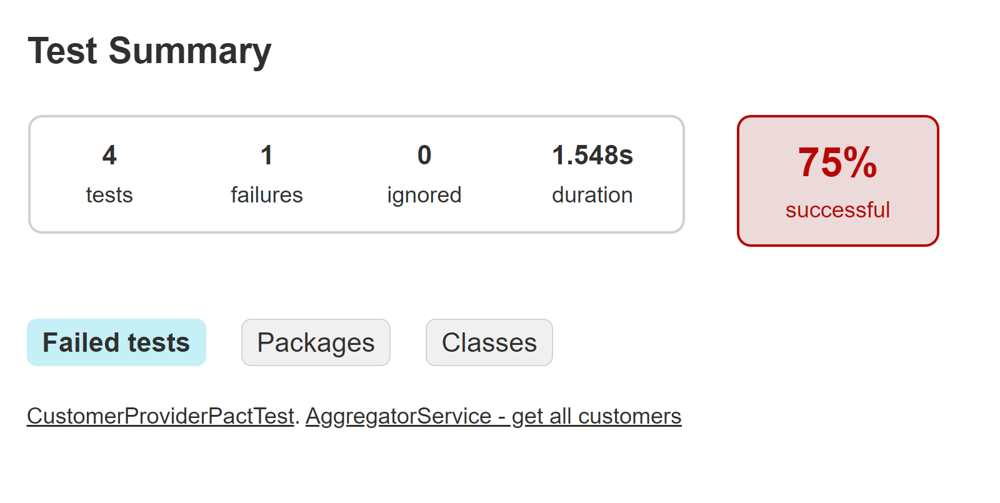
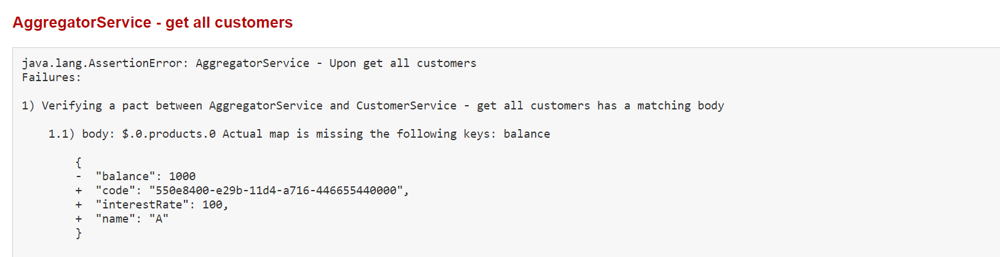

<div align="center">
  <p>Kacper Urbaniec | SWE | 11.11.2022</p>
  <h1><ins>Assignment 3: Dependencies</ins></h1>
</div>

## 🏗️ Architecture

* `provider.customer` | `CustomerService`

  Spring Boot service available @ http://localhost:8080     
  Provides a list of customers via a REST API. The customer has the typical information like name, address, date of birth, email address, status, and more. Besides the basic information, the customer has a list of financial products. Every product has a name, balance, product code, and interest rate, among others.

* `consumer.info` | `InfoService`

  Spring Boot service available @ http://localhost:8090     
  Provides a modified list of customer via REST API. Returns a list of all customers with name, email, and status.

* `consumer.aggregator` | `AggregatorService`

  Node service available @ http://localhost:9000     
  Provides a modified list of customer via REST API. Returns a list of all customers with names and an aggregated balance (sum of all product balances).

## 🤝 Test & Verify Pacts

1. Run tests & generate pact for `InfoService` consumer

   ```bash
   ./consumer.info/gradlew -p "consumer.info" test 
   ```

2. Run tests & generate pact for `AggregatorService` consumer

   ```bash
   npm --prefix ./consumer.aggregator/ run test 
   ```

3. Verfiy pacts for `CustomerService` provider

   ```bash
   ./provider.customer/gradlew -p "provider.customer" test 
   ```

For example, if one were to remove the `balance` field from the API `CustomerService`, the contract check would fail and output the following error messages.





Pact & other consumer-driven testing frameworks help detect breaking service modifications to prevent such client defects.

## 🚀 Run

1. `CustomerService`

   ```bash
   ./provider.customer/gradlew -p "provider.customer" bootRun 
   ```

   **API**

   * `/customers` - Query all customers

     ```bash
     curl http://localhost:8080/customers
     ```

   * `/customer/{customer-email}` - Query specific customer

     ```bash
     curl http://localhost:8080/customer/customer.c@gmail.com
     ```

2. `InfoService`

   Requires running `CustomerService`.

   ```bash
   ./consumer.info/gradlew -p "consumer.info" bootRun 
   ```

   **API**

   * `/customers` - Query all customer info

     ```bash
     curl http://localhost:8090/customers
     ```

3. `AggregatorService`

   Requires running `CustomerService`.

   ```bash
   npm --prefix ./consumer.aggregator/ run build 
   npm --prefix ./consumer.aggregator/ run start 
   ```

   **API**

   * `/customers` - Query all customers with aggregated balances

     ```bash
     curl http://localhost:9000/customers
     ```

Additionally, a postman collection can be found in the `test.postman` folder to manually interact with the services.

## Acknowledgments

* https://docs.pact.io/implementation_guides/javascript/readme
* https://github.com/pact-foundation/pact-js
* https://github.com/pact-foundation/pact-workshop-js
* https://docs.pact.io/implementation_guides/jvm
* https://github.com/pact-foundation/pact-workshop-jvm-spring